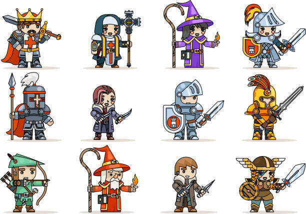

# Grop4
# 什麼是Git,GitHub,Gist,cmside

🔥 重要提醒！
<em>這是一段藍色斜體字</em>

[*我是網頁*](https://0118eric.github.io/Grop4/)
## 1. 什麼是GIT

  
   

可以用來**追蹤**之前修改的文件訊息以及資料，也可以共同使用同一套資料與訊息，還可以從一個分支做出來在合併大版本。
### 舉例
你玩一個RPG遊戲，每次玩不同的職業都會在你做出任何事情的時候紀錄當下的角色狀態，並可以從當前節點加入新玩家，還可以玩之前的存檔玩出其他結局。
## 2. 那什麼又是GitHub呢

  
   

像是google的雲端硬碟，但他是專門儲存git的雲端硬碟加上社群平台，這樣如果有人對你的git有興趣，就可以直接從GitHub上交流，並且一起研究，且好的git在上面可能會對於世界有好的貢獻。
### 所以
**GitHub像是一個儲存git的圖書館！**
## 3. 那什麼是Gist？

  
   

他是GitHub提供的一個小功能，他還是一個git，版本依然能看見改變，但是他很適合放小段程式碼、設定檔或筆記，而且每個gist都有網址。
重要的是，他有公開/私密的功能，如果在上傳重要的短程式碼，將可以用這個快速的傳給他人，並讓資料的更改紀錄存在上面，方便修改。

**就是會記錄你們做了什麼的便條紙，且可以設公開或私人**

## 4. cmside

### 網路內容管理系統
可以用來建立動態網站，靜態網站， 網誌與網際簡報系統。
cmside 就是工程師希望將各種與產品開發的過程資料, 存放在網站上, 除了可用於工程師之間的溝通外, 還能夠將產品開發的細節, 或者特定工具的使用詳細記錄。
### 舉例

我可以在網路上玩線上遊戲，可以跟別人一起玩，且可以找到各項的存檔的詳細記錄，並找尋每一關的重要道具。

## 5. 如何使用這些工具

  
   

當你想做一款網頁遊戲的時候，能夠和同伴一同寫git並上傳到github上，這樣在每一次修改與操作都將紀錄下來，並且可以用社群討倫如何讓遊戲更好，並在網站上重複測試，還可以從某個分支將同玩法不同劇情的遊戲製作出來。

## 6. 為什麼要使用這些工具？

## 7. 如何運用程式
